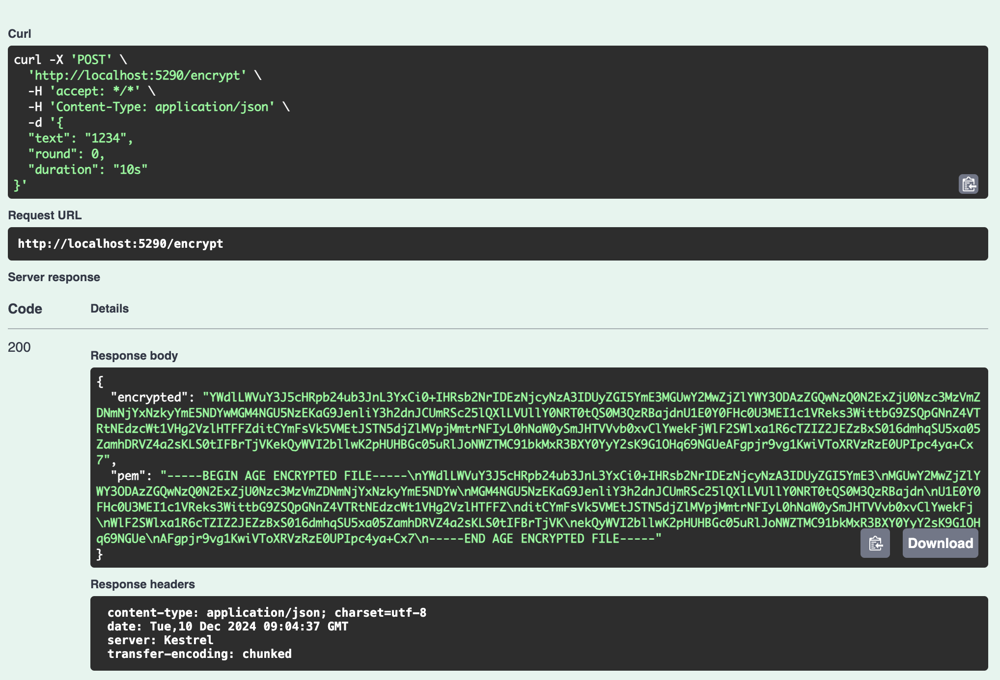
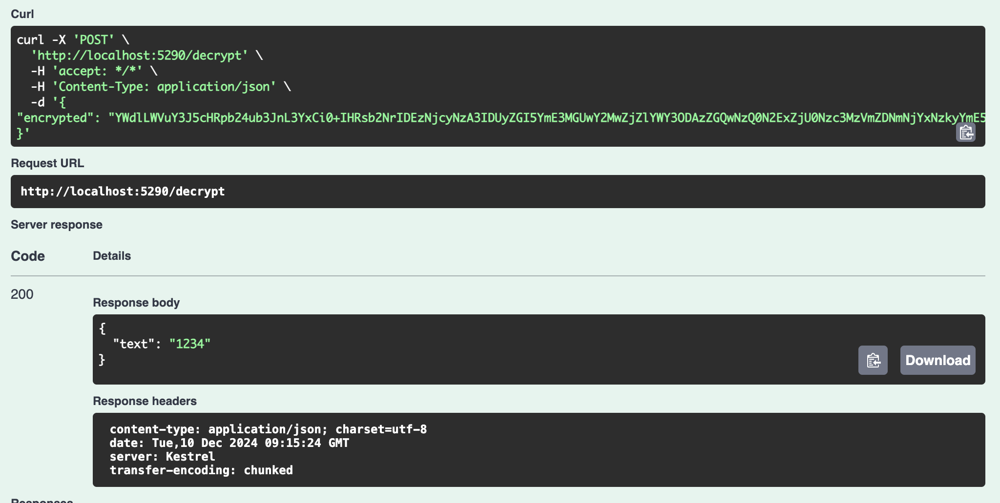

# TLock GRPC

This repo is providing services similar to drand [tlock](https://github.com/drand/tlock) cli tool. The services are provided via GRPC and there's an example C# client which exposes the services via an HTTP API and can be accessed via the swagger UI. For more information of tlock, refer to the [timelock blog](https://drand.love/blog/timelock-encryption-is-now-supported-on-drand-mainnet).

## Run

```
docker compose up -d
```

Then you can head over to `http://localhost:5290/swagger/index.html`.

For Encryption:


The PEM version of the encrypted data can be decrypted from [the drand Timevault UI](https://timevault.drand.love/).

For Decryption:



## Stop

```
docker compose down
```
